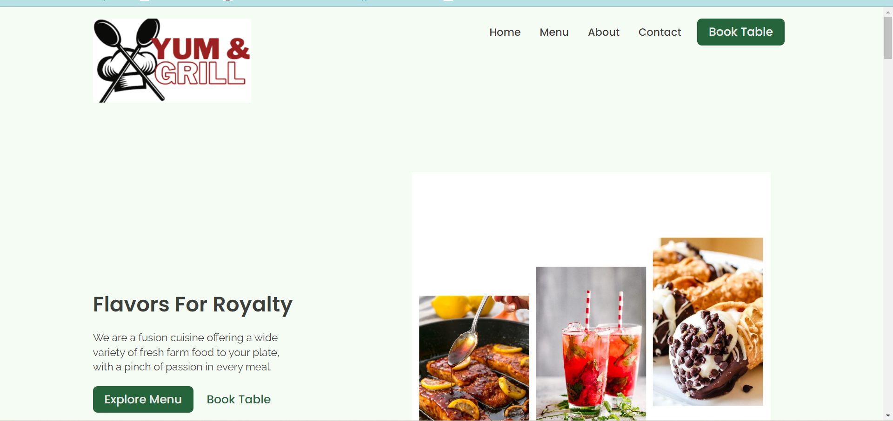

# YUM&GRILL 👨‍🍳

A `HTML, CSS` Project. Made with ♥ by the YUM&GRILL team. There will be 5 pages in the website (HomePage, MenuPage, AboutPage, ContactPage, BookingPage). In this project we learn how we can create a website using simple `HTML, CSS`. The main purpose of the project is to get more used to with HTML, CSS. Although we used a few lines of JavaScript in the project for necessary cases. Later on, in this project, we learn how we can deploy this site using `Netlify`. Also, we  learn the process from the zero to end and make the website ready for live production.

## What we are going to learn

- HTML, CSS
- CSS Grid
- Scroll Animation
- Netlify Deployment
- Netlify Form functionality
- More . . .

## Requirements

- Basic HTML, CSS

## Tools Used

1. icons - (flat & Feather icons)
2. illustration - [https://storyset.com/](https://storyset.com/)
3. UI Design: Figma
4. Code Editor: VS Code

## FAQ

### Who the project is for?

The project is for the people who wanna get more skilled in HTML & CSS.